# Technical Architecture

## Pipeline Overview

The SimOps pipeline is a dual-simulator architecture that separates policy production from policy validation, connected by an automated orchestration layer.


## Training Simulator Stack

The training side is optimized for **massive parallelism** and **fast iteration**.

### MuJoCo + Isaac Lab

| Component | Role | Key Specs |
|-----------|------|-----------|
| **MuJoCo** | Core physics engine for RL training | GPU-accelerated, 10,000+ envs parallel |
| **Isaac Lab** | RL framework on top of Isaac Sim | Built-in task definitions, domain randomization |
| **Policy format** | Trained neural network weights | PyTorch / ONNX export |

### Training Loop Characteristics

```
Timestep:        ~2ms (500Hz control loop)
Parallelism:     1,000–10,000 environments
Sim speed:       ~10,000× real-time (per GPU)
Physics fidelity: Simplified (rigid body, basic contact)
Training time:   Hours to days per policy iteration
```

!!! info "Why 500Hz?"
    Humanoid robots require high-frequency control loops (500Hz–1kHz) for joint impedance control and balance. The training simulator must match this frequency to produce policies that are transferable to real hardware.

## Validation Simulator Stack

The validation side is optimized for **physical accuracy** and **sensor realism**.

### AGX Dynamics + Unreal Engine 5 (Co-Simulation)


| Component | Role | Key Specs |
|-----------|------|-----------|
| **AGX Dynamics** | High-fidelity physics engine | Sub-ms timesteps, accurate contact/friction |
| **Unreal Engine 5** | Rendering & sensor simulation | Nanite, Lumen, ray-traced sensors |
| **Co-sim sync** | Deterministic timestep lock | Physics and rendering in lockstep |

### Validation Loop Characteristics

```
Timestep:          ~1ms (1kHz physics)
Parallelism:       1–4 instances (high compute per step)
Sim speed:         ~1× real-time (or slower for complex scenarios)
Physics fidelity:  High (deformable, cable, multi-contact)
Validation time:   Minutes to hours per policy candidate
```

## Orchestration Layer

The orchestrator is the automation backbone that connects training and validation.

### Core Responsibilities

```mermaid
flowchart TD
    A[New Policy from Training] --> B{Policy Candidate Selector}
    B -->|Selected| C[Scenario Generator]
    C --> D[Validation Execution]
    D --> E[Result Collection]
    E --> F{Failure Analyzer}
    F -->|Pass| G[✅ Promote to Hardware]
    F -->|Marginal| H[🔄 Targeted Re-training]
    F -->|Fail| I[❌ Generate New Scenarios]
    H --> A
    I --> A
    G --> J[Validation Report]
```



### Scenario Generation

The scenario generator creates test conditions that cover:

- **Nominal operation** — standard operating conditions
- **Edge cases** — boundary conditions derived from prior failures
- **Adversarial scenarios** — perturbations designed to expose weaknesses
- **Domain shift tests** — variations in physics parameters (mass, friction, damping)

### Failure Analysis

When a policy fails validation, the failure analyzer produces:

1. **Root cause classification** — contact failure, balance loss, trajectory error, etc.
2. **Reproducible scenario** — exact initial conditions and parameters
3. **Training recommendations** — suggested reward adjustments, domain randomization ranges, or curriculum changes

## Data Flow Summary

```
Training Simulator                    Validation Simulator
─────────────────                    ────────────────────
MuJoCo / Isaac Lab                   AGX Dynamics + UE5
       │                                    │
       ▼                                    ▼
  Policy (.pt/.onnx)  ──────────▶  Load & Execute Policy
                                           │
                                           ▼
                                   Physics + Sensor Data
                                           │
                                           ▼
                                   Validation Metrics
                                           │
                          ┌────────────────┼────────────────┐
                          ▼                ▼                ▼
                       ✅ Pass        🔄 Marginal       ❌ Fail
                          │                │                │
                          ▼                ▼                ▼
                     Deploy to HW    Re-train (targeted)  New scenarios
                                           │                │
                                           └────────────────┘
                                                  │
                                                  ▼
                                          Back to Training
```

## Technology Decision Rationale

!!! note "Why AGX Dynamics over alternatives?"

    | Criterion | AGX Dynamics | Drake | PyBullet |
    |-----------|-------------|-------|----------|
    | Contact accuracy | ✅ Industrial-grade | ✅ Good | ⚠️ Moderate |
    | Cable/deformable | ✅ Native | ❌ Limited | ❌ No |
    | UE5 integration | ✅ Official plugin | ⚠️ Custom needed | ❌ No |
    | Real-time capable | ✅ Yes | ✅ Yes | ✅ Yes |
    | Licensing | Commercial | BSD | Zlib |

    AGX was selected for the validation simulator due to its superior contact dynamics accuracy and native UE5 co-simulation support, which are critical for high-fidelity policy verification.
