# Curriculum Learning & Progressive Hardening

## Beyond Pass/Fail

A naive validation pipeline simply asks: **did the policy pass or fail?** SimOps goes further. The closed-loop feedback generates structured training signals that automatically refine the policy through **curriculum learning** and **progressive hardening**.

```mermaid
flowchart LR
    subgraph Naive["❌ Naive Approach"]
        N1["Train"] --> N2["Validate"]
        N2 -->|Pass| N3["Deploy"]
        N2 -->|Fail| N4["Retrain<br/>from scratch"]
    end

    subgraph SimOps["✅ SimOps Approach"]
        S1["Train"] --> S2["Validate"]
        S2 -->|Pass| S3["Deploy"]
        S2 -->|Fail| S4["Analyze failure"]
        S4 --> S5["Auto-adjust<br/>curriculum"]
        S5 --> S1
    end
```

## What Is Curriculum Learning?

Curriculum learning structures the training process from **easy to hard**, mirroring how humans learn. Instead of throwing the full complexity of a task at the agent from the start, the training environment gradually increases difficulty.

In SimOps, this curriculum is **not manually designed** — it is **automatically generated** from validation feedback.

```mermaid
flowchart TD
    subgraph CL["Automated Curriculum Pipeline"]
        V["🔬 Validation Results"] --> FA["📋 Failure Analysis"]
        FA --> FC["🏷️ Failure Classification"]
        FC --> CG["📐 Curriculum Generator"]
        CG --> L1["Level 1: Nominal conditions"]
        CG --> L2["Level 2: Mild perturbations"]
        CG --> L3["Level 3: Edge cases"]
        CG --> L4["Level 4: Adversarial scenarios"]
        L1 --> TR["🏋️ Training Simulator"]
        L2 --> TR
        L3 --> TR
        L4 --> TR
    end
```

### Curriculum Dimensions

The curriculum adjusts along multiple axes simultaneously:

| Dimension | Easy → Hard | Example |
|-----------|-------------|---------|
| **Physics perturbation** | Nominal parameters | ±30% mass, friction, damping |
| **Sensor noise** | Clean signals | Realistic noise + dropout |
| **Task complexity** | Static targets | Moving, accelerating targets |
| **Environmental variation** | Single environment | Randomized lighting, obstacles |
| **Timing pressure** | Relaxed deadlines | Real-time constraints |
| **Failure recovery** | No disturbances | External pushes, sensor failure |

## Progressive Hardening

Progressive hardening is the process by which a policy becomes **increasingly robust** through iterative validation-training cycles. Each cycle exposes new weaknesses, which are then addressed in the next training round.

```mermaid
flowchart TD
    subgraph Cycle1["Cycle 1: Basic Competence"]
        C1T["Train on nominal<br/>conditions"]
        C1V["Validate"]
        C1R["Result: 70% pass<br/>Fails on fast targets"]
        C1T --> C1V --> C1R
    end

    subgraph Cycle2["Cycle 2: Speed Robustness"]
        C2T["Train with expanded<br/>speed range"]
        C2V["Validate"]
        C2R["Result: 85% pass<br/>Fails on sensor noise"]
        C2T --> C2V --> C2R
    end

    subgraph Cycle3["Cycle 3: Sensor Robustness"]
        C3T["Train with realistic<br/>sensor artifacts"]
        C3V["Validate"]
        C3R["Result: 93% pass<br/>Fails on edge contacts"]
        C3T --> C3V --> C3R
    end

    subgraph Cycle4["Cycle 4: Contact Robustness"]
        C4T["Train with diverse<br/>contact scenarios"]
        C4V["Validate"]
        C4R["Result: 97% pass ✅<br/>Ready for hardware"]
        C4T --> C4V --> C4R
    end

    Cycle1 --> Cycle2 --> Cycle3 --> Cycle4
```

### The Hardening Gradient

Each hardening cycle operates at a specific **feedback level**:

```mermaid
graph BT
    subgraph Levels["Feedback Levels"]
        L1["Level 1: Reward Adjustment<br/>━━━━━━━━━━━━━━━━━━━<br/>Modify reward weights based on<br/>which failure modes dominate"]
        L2["Level 2: Domain Randomization<br/>━━━━━━━━━━━━━━━━━━━<br/>Expand parameter ranges where<br/>validation found brittleness"]
        L3["Level 3: Scenario Injection<br/>━━━━━━━━━━━━━━━━━━━<br/>Add specific failure scenarios<br/>as training environments"]
        L4["Level 4: Architecture Adaptation<br/>━━━━━━━━━━━━━━━━━━━<br/>Suggest network architecture changes<br/>when policy capacity is insufficient"]
    end

    L1 --> L2 --> L3 --> L4
```

| Level | Trigger | Action | Impact |
|-------|---------|--------|--------|
| **1. Reward Adjustment** | Consistent failure pattern | Re-weight reward components | Low — fastest iteration |
| **2. Domain Randomization** | Brittle at parameter boundaries | Expand randomization ranges | Medium — broader coverage |
| **3. Scenario Injection** | Specific failure modes | Add targeted training scenarios | High — addresses root causes |
| **4. Architecture Adaptation** | Policy capacity exhausted | Modify network size/structure | Highest — fundamental change |

## Automated Feedback Loop Detail

### From Validation Failure to Training Signal

```mermaid
sequenceDiagram
    participant VS as 🔬 Validation Sim
    participant FA as 📋 Failure Analyzer
    participant CG as 📐 Curriculum Generator
    participant TS as 🏋️ Training Sim

    VS->>FA: Validation results + telemetry
    FA->>FA: Classify failure modes
    FA->>FA: Compute severity scores
    FA->>CG: Failure report + root causes

    CG->>CG: Determine feedback level
    CG->>CG: Generate curriculum update

    alt Level 1: Reward
        CG->>TS: Updated reward weights
    else Level 2: Randomization
        CG->>TS: Expanded DR parameters
    else Level 3: Scenario
        CG->>TS: New training scenarios
    else Level 4: Architecture
        CG->>TS: Architecture recommendations
    end

    TS->>TS: Resume training with updates
    TS->>VS: New policy candidate
```

### Failure Classification Taxonomy

The failure analyzer categorizes each failure into a structured taxonomy:

| Category | Subcategories | Typical Feedback Level |
|----------|--------------|----------------------|
| **Kinematic failure** | Joint limits, workspace boundary, singularity | Level 1–2 |
| **Dynamic failure** | Balance loss, excessive force, velocity limit | Level 2–3 |
| **Contact failure** | Missed contact, slip, unintended collision | Level 2–3 |
| **Perception failure** | Object misdetection, depth error, latency | Level 2–3 |
| **Planning failure** | Suboptimal trajectory, timing error | Level 1–3 |
| **Generalization failure** | Works in training distribution, fails outside | Level 3–4 |

## Convergence Monitoring

SimOps tracks the hardening progress to detect convergence and identify diminishing returns:

```mermaid
graph LR
    subgraph Monitoring["Convergence Dashboard"]
        direction TB
        M1["📈 Pass rate trend across cycles"]
        M2["📊 Failure mode distribution shift"]
        M3["🎯 Gap metrics convergence"]
        M4["⏱️ Training efficiency per cycle"]
        M5["🔄 New failure discovery rate"]
    end
```

### Convergence Criteria

A policy is considered **hardened** when:

1. **Pass rate** exceeds target threshold (e.g., > 95%) across all scenario categories
2. **No new failure modes** discovered in the last N validation runs
3. **Gap metrics** are within bounded tolerances (see [Sim-to-Real Gap Quantification](sim2real-gap.md))
4. **Marginal improvement** per cycle drops below efficiency threshold

!!! success "Key Insight"
    Progressive hardening transforms validation from a **binary gate** into a **continuous improvement engine**. Each failure makes the next policy stronger, and the system knows when it has converged.

## Comparison: Manual vs SimOps Hardening

| Aspect | Manual Approach | SimOps Automated |
|--------|----------------|-----------------|
| Failure analysis | Engineer inspects logs | Automated classification |
| Curriculum design | Hand-crafted difficulty levels | Auto-generated from failures |
| Feedback speed | Days (human in the loop) | Minutes (automated pipeline) |
| Coverage | Limited by engineer intuition | Systematic + exhaustive |
| Reproducibility | Low — depends on individual | High — deterministic pipeline |
| Convergence detection | Subjective judgment | Quantitative criteria |
