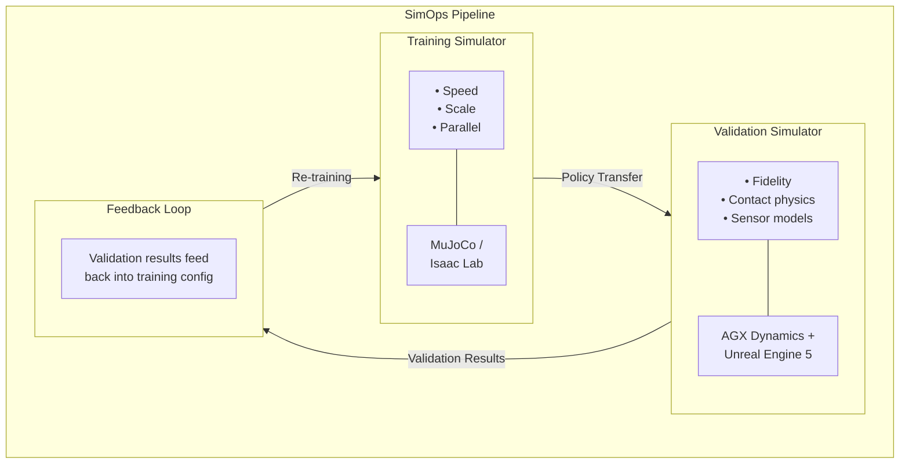

# SimOps Concept Overview

## The Problem

Modern robotics development faces a fundamental tension: **training simulators** prioritize speed and parallelism to produce policies at scale, while **real-world deployment** demands physically accurate validation before a policy ever touches hardware.

Today, most teams use a single simulator for both purposes — or skip validation entirely, relying on expensive physical prototypes. This creates:

- **Sim-to-real gaps** that only surface on hardware
- **Slow iteration cycles** when physical prototypes are the primary validation tool
- **No systematic quality gate** between policy training and deployment

## The SimOps Framework

SimOps introduces a clear separation of concerns:

### Training Simulator — Policy Production

The training simulator is optimized for **throughput**. Its job is to produce candidate policies as fast as possible through massively parallel reinforcement learning.

| Priority | Approach |
|----------|----------|
| Speed | Simplified physics, GPU-accelerated environments |
| Scale | Thousands of parallel instances |
| Iteration | Rapid experimentation with reward shaping |

**Typical engines:** MuJoCo, Isaac Lab (Isaac Sim)

### Validation Simulator — Policy Verification

The validation simulator is optimized for **fidelity**. It acts as the quality gate before any policy reaches physical hardware.

| Priority | Approach |
|----------|----------|
| Physical accuracy | High-fidelity contact, friction, deformation models |
| Sensor realism | Camera, LiDAR, IMU models matching real hardware |
| Scenario coverage | Edge cases, failure modes, adversarial conditions |

**Typical engines:** AGX Dynamics (co-simulation with Unreal Engine 5)

### Closed-Loop Feedback

The key innovation is the **closed loop**: validation results automatically feed back into the training pipeline.

- **Pass** → Policy is promoted to hardware deployment candidate
- **Fail** → Failure analysis generates new training scenarios, reward adjustments, or domain randomization parameters
- **Marginal** → Targeted re-training on specific failure modes

This creates a self-improving pipeline where each validation cycle makes training more effective.

## Why Not Just One Simulator?

!!! question "Can't a single high-fidelity simulator do both?"

    In theory, yes. In practice, the requirements are contradictory:

    - Training needs **1,000+ parallel instances** running at **10,000× real-time** → requires simplified physics
    - Validation needs **sub-millisecond timesteps** with **accurate contact dynamics** → requires heavy computation per step

    Forcing a single simulator to do both means either slow training or unreliable validation. SimOps eliminates this trade-off.

## Analogy: DevOps → SimOps

Just as **DevOps** separated development and operations while automating the pipeline between them, **SimOps** separates training and validation while automating the feedback loop.

| DevOps | SimOps |
|--------|--------|
| Dev environment | Training simulator |
| Staging / QA | Validation simulator |
| CI/CD pipeline | Automated policy promotion |
| Test results → bug fixes | Validation failures → training adjustments |
| Infrastructure as Code | Simulation as Code |
