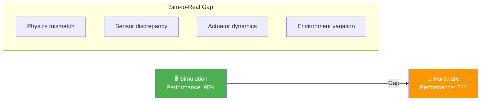
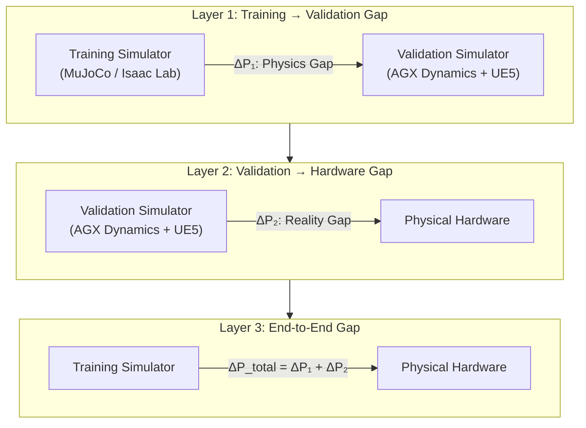
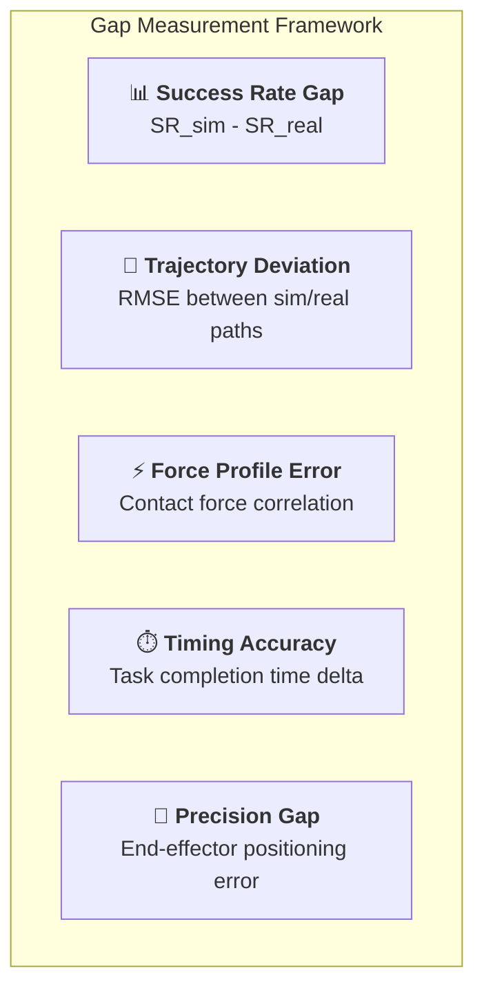
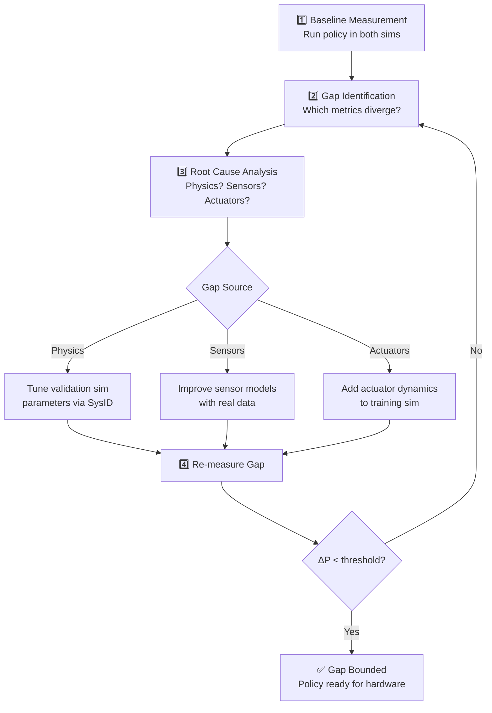

# Sim-to-Real Gap Quantification

## The Core Challenge

Every robotic policy trained in simulation must eventually run on physical hardware. The performance difference between simulation and reality — the **sim-to-real gap** — is the fundamental obstacle that SimOps is designed to address systematically.



!!! danger "The Hidden Risk"
    Without systematic gap quantification, teams discover sim-to-real failures **on hardware** — the most expensive and time-consuming place to find them.

## Three-Layer Gap Model

SimOps quantifies the sim-to-real gap across three distinct layers, each measured independently:



### Layer 1: Training → Validation Gap (ΔP₁)

This is the gap SimOps **can measure and reduce** through the dual-simulator pipeline.

| Metric | Training Sim | Validation Sim | Typical ΔP₁ |
|--------|-------------|----------------|-------------|
| Contact force accuracy | ±20–50% | ±2–5% | 15–45% |
| Joint torque tracking | ±10–30% | ±1–3% | 9–27% |
| Sensor noise model | Gaussian only | Hardware-matched | Variable |
| Collision detection | Simplified mesh | Convex decomposition | 10–30% |

### Layer 2: Validation → Hardware Gap (ΔP₂)

This is the **residual gap** between the validation simulator and reality. A well-configured AGX Dynamics + UE5 setup minimizes this.

| Source | Typical Contribution | Mitigation |
|--------|---------------------|------------|
| Unmodeled friction | 2–8% | System identification |
| Actuator backlash | 1–5% | Motor characterization |
| Sensor calibration | 1–3% | Hardware-in-the-loop |
| Environmental factors | 1–5% | Domain randomization |

### Layer 3: End-to-End Gap (ΔP_total)

The total gap is a composition of both layers:

```
ΔP_total = ΔP₁ + ΔP₂ - ΔP_overlap

Without SimOps:   ΔP_total = ΔP₁ + ΔP₂ ≈ 30–60%  (unmeasured)
With SimOps:      ΔP₁ is measured and reduced through feedback
                  ΔP₂ is minimized through high-fidelity validation
                  ΔP_total ≈ 5–15%  (measured and bounded)
```

## Gap Measurement Metrics

SimOps defines standardized metrics for quantifying the gap at each layer:

### Task-Level Metrics



| Metric | Formula | Target |
|--------|---------|--------|
| Success Rate Gap | SR_sim − SR_real | < 5% |
| Trajectory RMSE | √(Σ(p_sim − p_real)²/n) | < 10mm |
| Force Correlation | corr(F_sim, F_real) | > 0.95 |
| Timing Delta | \|t_sim − t_real\| / t_real | < 3% |
| Positioning Error | \|x_sim − x_real\| | < 5mm |

### Sensor-Level Metrics

| Sensor | Gap Metric | Measurement Method |
|--------|-----------|-------------------|
| Depth camera (D435) | Depth error distribution | Comparison with ground truth point cloud |
| IMU | Drift rate comparison | Allan variance analysis |
| Force/Torque | Magnitude + direction error | Calibrated load cell reference |
| Joint encoders | Position/velocity error | Optical encoder reference |

## Gap Reduction Pipeline

The key insight: **measuring the gap enables reducing it**.



## Practical Example: Badminton Rally Robot

For the badminton rally robot showcase, the gap quantification focuses on:

| Aspect | Training Sim Gap | Validation Sim Gap | Target |
|--------|-----------------|-------------------|--------|
| Shuttlecock trajectory prediction | ±15cm at impact | ±3cm at impact | ±5cm |
| Racket contact timing | ±20ms | ±3ms | ±5ms |
| Arm joint tracking | ±5° at peak velocity | ±0.5° | ±1° |
| Shuttlecock aerodynamics | Simplified drag | Full Magnus + tumble | Match real flight |
| Depth camera latency | Not modeled | Hardware-matched | < 5ms delta |

!!! tip "The SimOps Advantage"
    Without the dual-simulator approach, teams would only discover these gaps on hardware. SimOps catches them in the validation simulator — where iteration is 10–100× faster and cheaper than physical prototyping.
