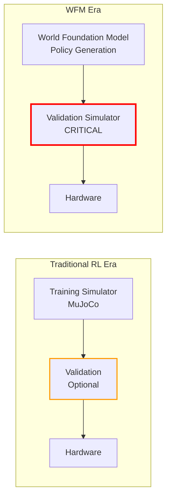
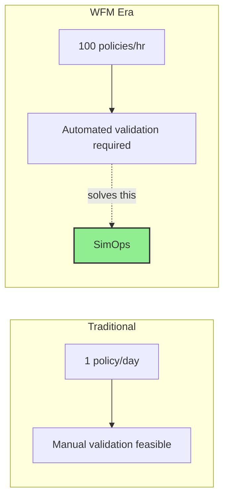
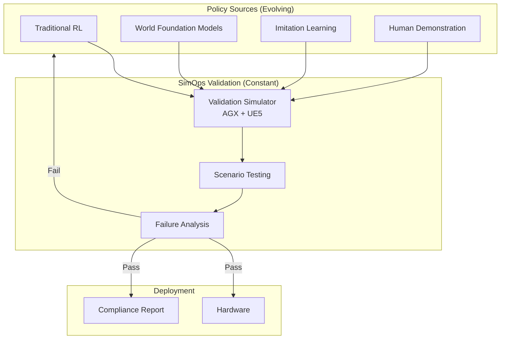

# SimOps in the WFM Era

## What Are World Foundation Models?

World Foundation Models (WFMs) — also referred to as World Action Models (WAMs) — are large-scale generative models trained on massive datasets of physics interactions, video, and sensor data. They learn to predict how the physical world behaves, potentially replacing or augmenting traditional physics simulators for policy training.

Key players include NVIDIA (Cosmos), Google DeepMind (Genie), and various robotics startups building foundation models for manipulation and locomotion.

## The WFM Promise

WFMs promise to revolutionize robotic policy production:

- **Zero-shot generalization** — policies that work across diverse environments without explicit training
- **Learned physics** — no need to hand-tune simulation parameters
- **Massive pre-training** — leveraging internet-scale data for world understanding
- **Rapid policy generation** — generate candidate behaviors from natural language or demonstrations

## Why SimOps Becomes *More* Critical

!!! warning "A common misconception"
    "If WFMs can generate policies directly, we don't need simulation anymore."

    This is incorrect. **WFMs replace the training simulator, not the validation simulator.** The need for physics-based validation actually *increases* as policy production becomes faster and less transparent.

### The Validation Gap Widens

When policies come from a WFM:

| Aspect | Traditional RL | WFM-Generated |
|--------|---------------|---------------|
| Policy origin | Explicit reward + physics sim | Learned world model |
| Transparency | Reward function is inspectable | Black-box generation |
| Failure modes | Predictable from sim assumptions | Novel, unexpected |
| Production rate | Slow (hours/days per policy) | Fast (minutes per policy) |
| Validation need | Important | **Essential** |

### Three Reasons SimOps Value Grows with WFMs

#### 1. Black-Box Policies Need Independent Verification

Traditional RL policies are trained in a physics simulator with explicit reward functions. You can inspect what the policy was optimized for. WFM-generated policies are outputs of a learned world model — there is no explicit reward function to inspect, and the "physics" are whatever the model learned from data.

**SimOps provides the independent, physics-grounded verification layer that WFM outputs require.**

#### 2. Faster Production = More Validation Throughput Needed

If a WFM can generate 100 candidate policies per hour instead of 1 per day, the validation bottleneck becomes the critical path. SimOps automates this bottleneck:

#### 3. Regulatory and Safety Requirements Don't Disappear

As robots move into safety-critical applications (manufacturing, healthcare, autonomous vehicles), regulatory bodies will demand **auditable, reproducible validation** regardless of how the policy was produced.

WFMs cannot provide this. A physics-based validation simulator with deterministic replay can.

## SimOps as the Universal Validation Layer

SimOps is designed to be **agnostic to policy origin**. Whether a policy comes from:

- Traditional RL (MuJoCo, Isaac Lab)
- World Foundation Models (Cosmos, Genie)
- Imitation learning
- Human demonstration
- Hybrid approaches

...it enters the same validation pipeline and must pass the same physics-based quality gates.

## Coexistence, Not Replacement

SimOps takes a clear position: **WFMs and physics-based validation coexist.**

| Layer | Current | WFM Era |
|-------|---------|---------|
| Policy production | RL in physics sim | WFMs (primary) + RL (specialized) |
| Validation | Often skipped | **SimOps** (automated, mandatory) |
| Deployment | Manual testing | Automated promotion with audit trail |

The more powerful and opaque policy production becomes, the more critical transparent, physics-grounded validation becomes. **SimOps is positioned not as a competitor to WFMs, but as their essential complement.**

## Long-Term Vision: Certification & Compliance

As the robotics industry matures, SimOps validation naturally extends into **certification and compliance**:

- **Standardized test scenarios** for specific robot categories
- **Reproducible validation reports** for regulatory submission
- **Continuous compliance monitoring** for deployed policies
- **Industry benchmarks** for sim-to-real transfer quality

This positions SimOps not just as a development tool, but as infrastructure for the robotics industry's quality assurance ecosystem.
