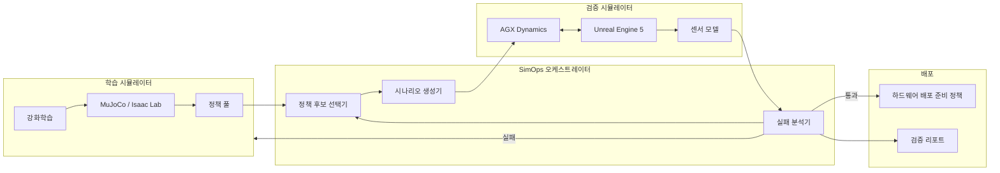
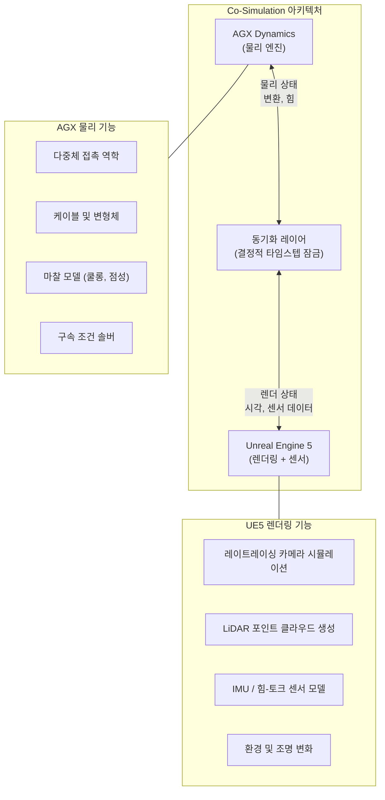
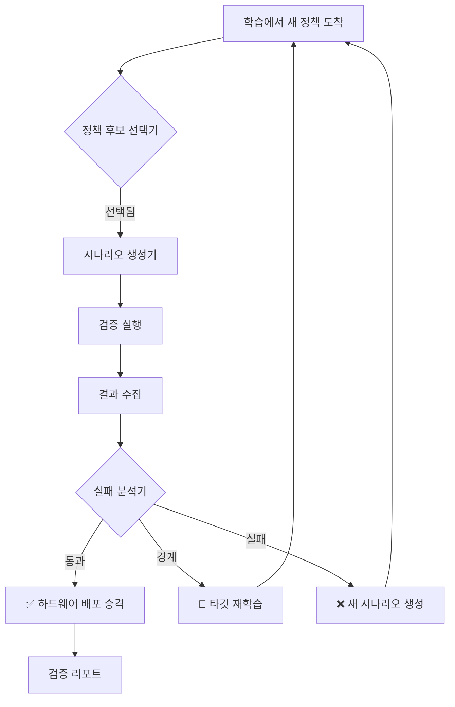
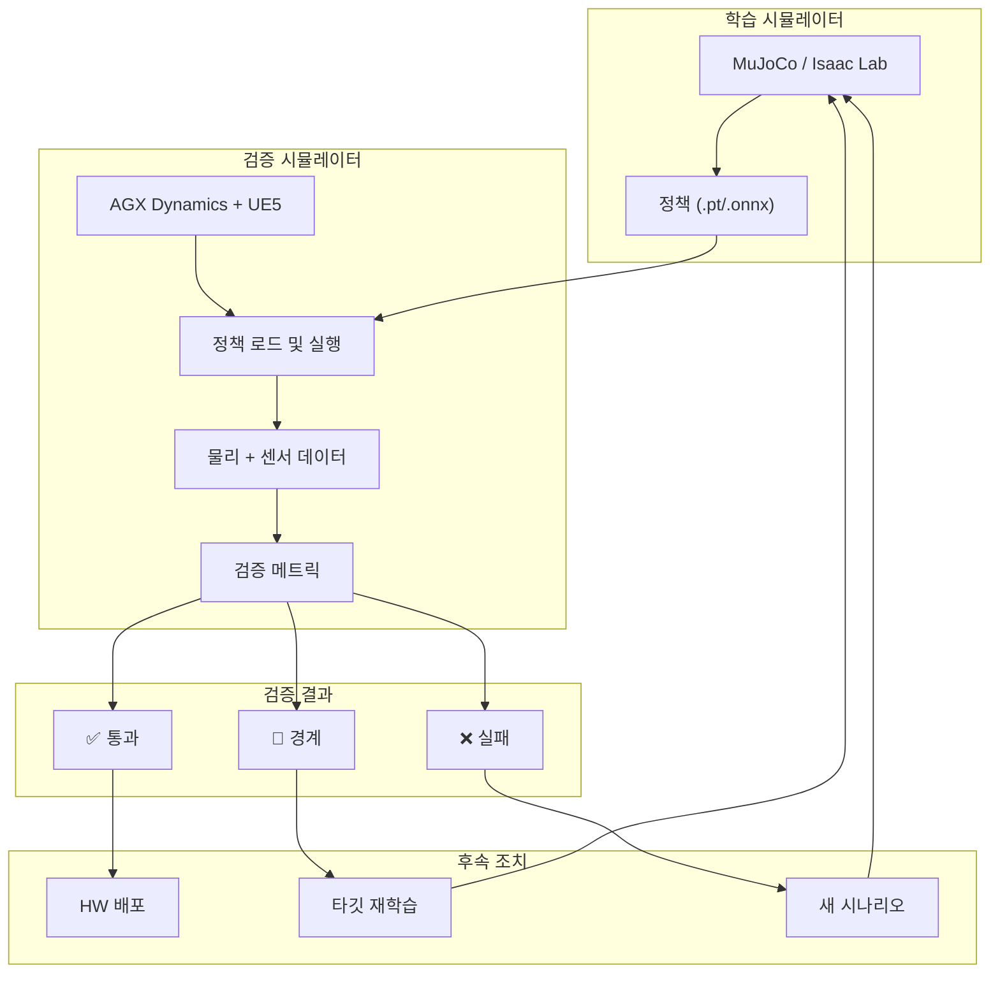

# 기술 아키텍처

## 파이프라인 개요

SimOps 파이프라인은 정책 생산과 정책 검증을 분리하고, 자동화된 오케스트레이션 레이어로 연결하는 이중 시뮬레이터 아키텍처입니다.



## 학습 시뮬레이터 스택

학습 측은 **대규모 병렬성**과 **빠른 반복**에 최적화되어 있습니다.

### MuJoCo + Isaac Lab

| 컴포넌트 | 역할 | 주요 스펙 |
|---------|------|----------|
| **MuJoCo** | RL 학습용 핵심 물리 엔진 | GPU 가속, 10,000+ 병렬 환경 |
| **Isaac Lab** | Isaac Sim 기반 RL 프레임워크 | 내장 태스크 정의, 도메인 랜덤화 |
| **정책 포맷** | 학습된 신경망 가중치 | PyTorch / ONNX 내보내기 |

### 학습 루프 특성

```
타임스텝:         ~2ms (500Hz 제어 루프)
병렬화:          1,000–10,000 환경
시뮬레이션 속도:  ~10,000× 실시간 (GPU당)
물리 충실도:      단순화 (강체, 기본 접촉)
학습 시간:        정책 반복당 수 시간~수 일
```

!!! info "왜 500Hz인가?"
    휴머노이드 로봇은 관절 임피던스 제어와 균형 유지를 위해 고주파 제어 루프(500Hz–1kHz)가 필요합니다. 학습 시뮬레이터는 실제 하드웨어로 전이 가능한 정책을 생산하기 위해 이 주파수를 맞춰야 합니다.

## 검증 시뮬레이터 스택

검증 측은 **물리적 정확성**과 **센서 리얼리즘**에 최적화되어 있습니다.

### AGX Dynamics + Unreal Engine 5 (Co-Simulation)



| 컴포넌트 | 역할 | 주요 스펙 |
|---------|------|----------|
| **AGX Dynamics** | 고충실도 물리 엔진 | 서브밀리초 타임스텝, 정확한 접촉/마찰 |
| **Unreal Engine 5** | 렌더링 및 센서 시뮬레이션 | Nanite, Lumen, 레이트레이싱 센서 |
| **Co-sim 동기화** | 결정적 타임스텝 잠금 | 물리와 렌더링의 동기 실행 |

### 검증 루프 특성

```
타임스텝:          ~1ms (1kHz 물리)
병렬화:           1–4 인스턴스 (스텝당 높은 연산량)
시뮬레이션 속도:   ~1× 실시간 (복잡한 시나리오에서는 더 느림)
물리 충실도:       높음 (변형체, 케이블, 다중 접촉)
검증 시간:         정책 후보당 수 분~수 시간
```

## 오케스트레이션 레이어

오케스트레이터는 학습과 검증을 연결하는 자동화 백본입니다.

### 핵심 책임



### 시나리오 생성

시나리오 생성기는 다음을 커버하는 테스트 조건을 생성합니다:

- **정상 운영** — 표준 운영 조건
- **엣지 케이스** — 이전 실패에서 파생된 경계 조건
- **적대적 시나리오** — 약점을 노출시키기 위해 설계된 섭동
- **도메인 시프트 테스트** — 물리 파라미터(질량, 마찰, 감쇠) 변화

### 실패 분석

정책이 검증에 실패하면 실패 분석기가 다음을 생성합니다:

1. **근본 원인 분류** — 접촉 실패, 균형 상실, 궤적 오류 등
2. **재현 가능한 시나리오** — 정확한 초기 조건과 파라미터
3. **학습 권장사항** — 보상 조정, 도메인 랜덤화 범위, 커리큘럼 변경 제안

## 데이터 흐름 요약



## 기술 선택 근거

!!! note "왜 AGX Dynamics인가?"

    | 기준 | AGX Dynamics | Drake | PyBullet |
    |------|-------------|-------|----------|
    | 접촉 정확도 | ✅ 산업 수준 | ✅ 양호 | ⚠️ 보통 |
    | 케이블/변형체 | ✅ 네이티브 | ❌ 제한적 | ❌ 미지원 |
    | UE5 연동 | ✅ 공식 플러그인 | ⚠️ 커스텀 필요 | ❌ 미지원 |
    | 실시간 가능 | ✅ 가능 | ✅ 가능 | ✅ 가능 |
    | 라이선스 | 상용 | BSD | Zlib |

    AGX는 우수한 접촉 역학 정확도와 네이티브 UE5 co-simulation 지원으로 인해 검증 시뮬레이터로 선택되었으며, 이는 고충실도 정책 검증에 필수적입니다.
