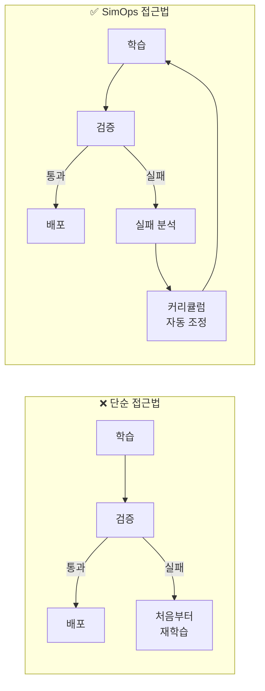
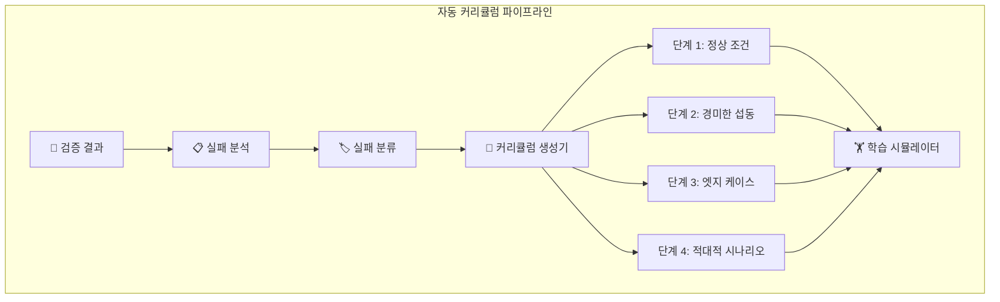
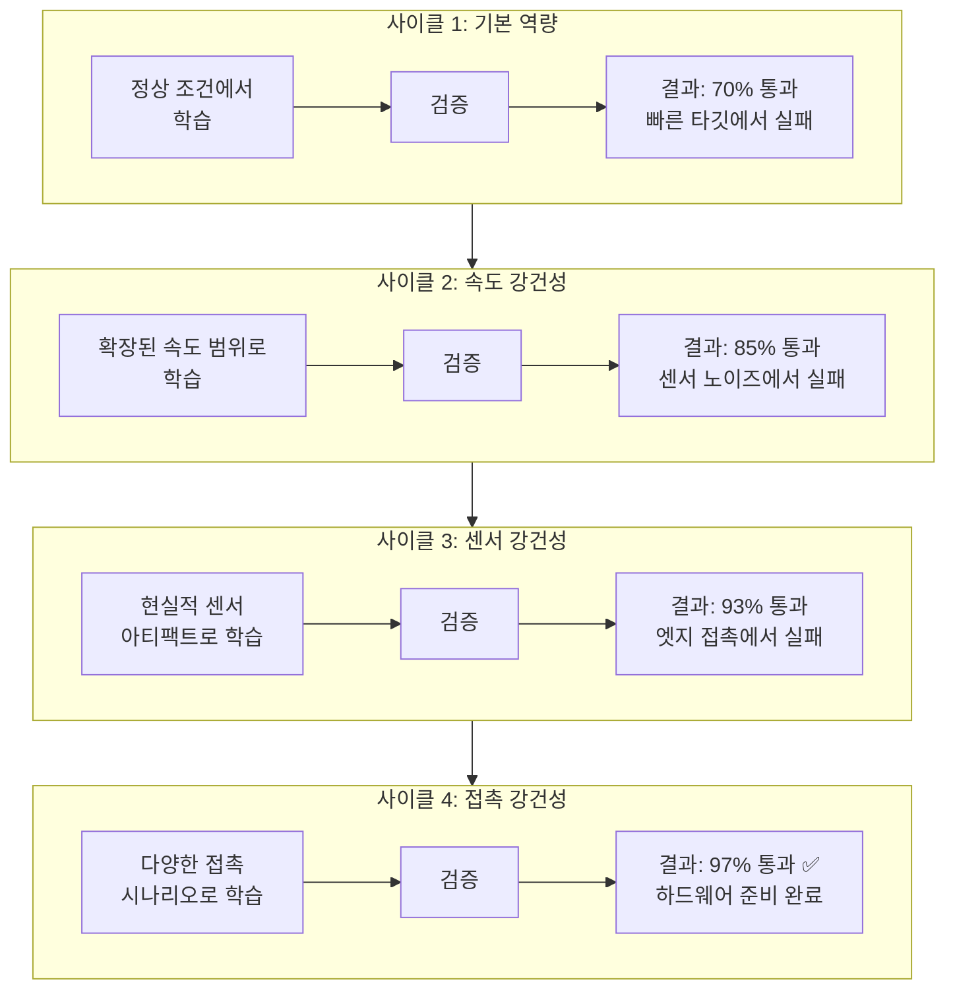
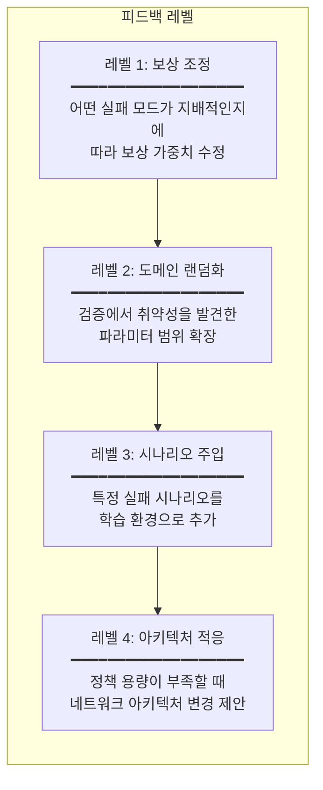
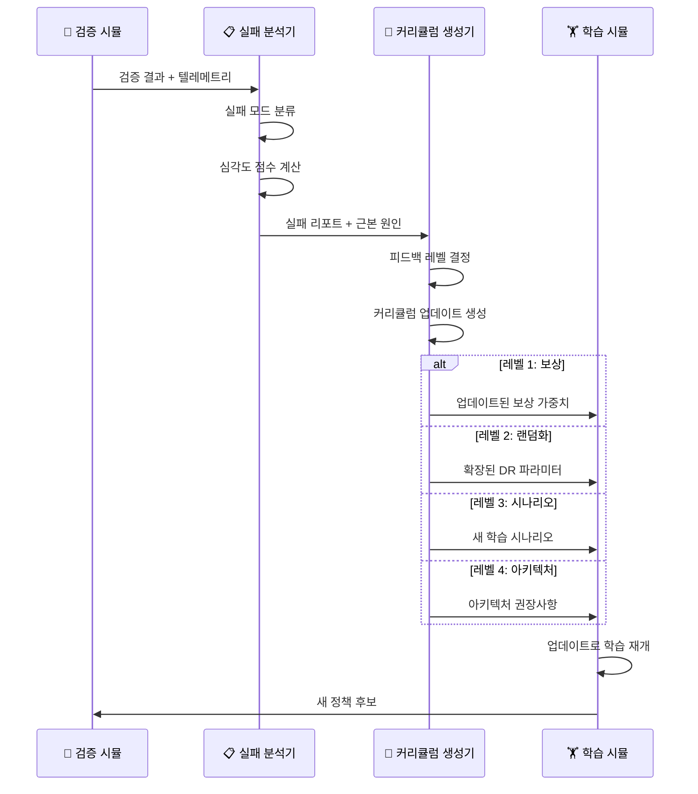

# 커리큘럼 학습 & 점진적 경화

## Pass/Fail을 넘어서

단순한 검증 파이프라인은 이렇게만 묻습니다: **정책이 통과했는가, 실패했는가?** SimOps는 더 나아갑니다. 폐루프 피드백이 구조화된 학습 신호를 생성하여, **커리큘럼 학습**과 **점진적 경화(Progressive Hardening)**를 통해 자동으로 정책을 정제합니다.

## 커리큘럼 학습이란?

커리큘럼 학습은 학습 과정을 **쉬운 것에서 어려운 것으로** 구조화합니다. 인간의 학습 방식과 동일합니다. 처음부터 태스크의 전체 복잡성을 에이전트에게 던지는 대신, 학습 환경이 점진적으로 난이도를 높입니다.

SimOps에서 이 커리큘럼은 **수동으로 설계되지 않습니다** — 검증 피드백으로부터 **자동 생성**됩니다.

### 커리큘럼 차원

커리큘럼은 여러 축을 동시에 조정합니다:

| 차원 | 쉬움 → 어려움 | 예시 |
|------|-------------|------|
| **물리 섭동** | 명목 파라미터 | ±30% 질량, 마찰, 감쇠 |
| **센서 노이즈** | 깨끗한 신호 | 현실적 노이즈 + 드롭아웃 |
| **태스크 복잡도** | 정적 타깃 | 이동, 가속하는 타깃 |
| **환경 변화** | 단일 환경 | 랜덤화된 조명, 장애물 |
| **시간 압박** | 여유 있는 마감 | 실시간 제약 |
| **실패 복구** | 방해 없음 | 외부 충격, 센서 고장 |

## 점진적 경화 (Progressive Hardening)

점진적 경화는 반복적인 검증-학습 사이클을 통해 정책이 **점점 더 강건해지는** 과정입니다. 각 사이클은 새로운 약점을 노출하고, 다음 학습 라운드에서 이를 해결합니다.

### 경화 그래디언트

각 경화 사이클은 특정 **피드백 레벨**에서 작동합니다:

| 레벨 | 트리거 | 액션 | 영향 |
|------|--------|------|------|
| **1. 보상 조정** | 일관된 실패 패턴 | 보상 구성요소 재가중 | 낮음 — 가장 빠른 반복 |
| **2. 도메인 랜덤화** | 파라미터 경계에서 취약 | 랜덤화 범위 확장 | 중간 — 넓은 커버리지 |
| **3. 시나리오 주입** | 특정 실패 모드 | 타깃 학습 시나리오 추가 | 높음 — 근본 원인 해결 |
| **4. 아키텍처 적응** | 정책 용량 소진 | 네트워크 크기/구조 수정 | 최고 — 근본적 변화 |

## 자동 피드백 루프 상세

### 검증 실패에서 학습 신호까지

### 실패 분류 체계

실패 분석기는 각 실패를 구조화된 분류 체계로 카테고리화합니다:

| 카테고리 | 하위 분류 | 일반적 피드백 레벨 |
|---------|---------|------------------|
| **기구학적 실패** | 관절 한계, 작업 공간 경계, 특이점 | 레벨 1–2 |
| **동역학적 실패** | 균형 상실, 과도한 힘, 속도 한계 | 레벨 2–3 |
| **접촉 실패** | 접촉 실패, 미끄러짐, 의도치 않은 충돌 | 레벨 2–3 |
| **인지 실패** | 객체 미검출, 깊이 오차, 레이턴시 | 레벨 2–3 |
| **계획 실패** | 비최적 궤적, 타이밍 오류 | 레벨 1–3 |
| **일반화 실패** | 학습 분포에서 작동, 외부에서 실패 | 레벨 3–4 |

## 수렴 모니터링

SimOps는 경화 진행 상황을 추적하여 수렴을 감지하고 수익 체감점을 식별합니다:

### 수렴 기준

정책이 **경화 완료**로 간주되는 조건:

1. **통과율**이 모든 시나리오 카테고리에서 목표 임계값(예: > 95%) 초과
2. 최근 N회 검증 실행에서 **새 실패 모드 미발견**
3. **갭 메트릭**이 바운드된 허용 범위 내 (참조: [Sim-to-Real 갭 정량화](sim2real-gap.md))
4. **사이클당 한계 개선**이 효율 임계값 이하로 하락

!!! success "핵심 통찰"
    점진적 경화는 검증을 **이진 게이트**에서 **지속적 개선 엔진**으로 변환합니다. 각 실패가 다음 정책을 더 강하게 만들고, 시스템은 수렴 시점을 알고 있습니다.

## 비교: 수동 vs SimOps 경화

| 측면 | 수동 접근법 | SimOps 자동화 |
|------|-----------|-------------|
| 실패 분석 | 엔지니어가 로그 검토 | 자동 분류 |
| 커리큘럼 설계 | 수작업 난이도 레벨 | 실패로부터 자동 생성 |
| 피드백 속도 | 수 일 (사람 개입) | 수 분 (자동 파이프라인) |
| 커버리지 | 엔지니어 직관에 제한 | 체계적 + 철저 |
| 재현성 | 낮음 — 개인에 의존 | 높음 — 결정적 파이프라인 |
| 수렴 감지 | 주관적 판단 | 정량적 기준 |
