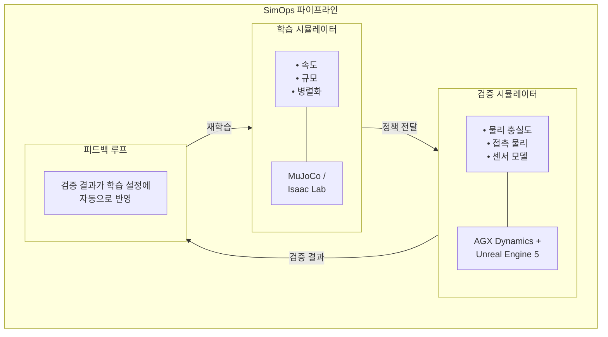

# SimOps 컨셉 개요

## 문제 정의

현대 로보틱스 개발에는 근본적인 긴장이 존재합니다. **학습 시뮬레이터**는 대규모 정책 생산을 위해 속도와 병렬성을 우선시하는 반면, **실제 배포**는 하드웨어에 정책을 적용하기 전에 물리적으로 정확한 검증을 요구합니다.

현재 대부분의 팀은 하나의 시뮬레이터로 두 가지 목적을 모두 해결하거나, 검증을 생략하고 고비용의 물리 프로토타입에 의존하고 있습니다. 이로 인해 발생하는 문제:

- 하드웨어에서만 드러나는 **Sim-to-Real 갭**
- 물리 프로토타입이 주요 검증 수단일 때의 **느린 반복 주기**
- 정책 학습과 배포 사이의 **체계적 품질 게이트 부재**

## SimOps 프레임워크

SimOps는 명확한 **관심사 분리(Separation of Concerns)**를 도입합니다:

### 학습 시뮬레이터 — 정책 생산

학습 시뮬레이터는 **처리량(throughput)**에 최적화됩니다. 대규모 병렬 강화학습을 통해 후보 정책을 가능한 빠르게 생산하는 것이 목표입니다.

| 우선순위 | 접근 방식 |
|---------|----------|
| 속도 | 단순화된 물리, GPU 가속 환경 |
| 규모 | 수천 개의 병렬 인스턴스 |
| 반복 | 보상 설계를 통한 빠른 실험 |

**주요 엔진:** MuJoCo, Isaac Lab (Isaac Sim)

### 검증 시뮬레이터 — 정책 검증

검증 시뮬레이터는 **충실도(fidelity)**에 최적화됩니다. 정책이 물리 하드웨어에 도달하기 전의 품질 게이트 역할을 합니다.

| 우선순위 | 접근 방식 |
|---------|----------|
| 물리적 정확성 | 고충실도 접촉, 마찰, 변형 모델 |
| 센서 리얼리즘 | 실제 하드웨어와 일치하는 카메라, LiDAR, IMU 모델 |
| 시나리오 커버리지 | 엣지 케이스, 실패 모드, 적대적 조건 |

**주요 엔진:** AGX Dynamics (Unreal Engine 5와 co-simulation)

### 폐루프 피드백

핵심 혁신은 **폐루프(Closed Loop)** 구조입니다: 검증 결과가 자동으로 학습 파이프라인에 피드백됩니다.

- **통과(Pass)** → 정책이 하드웨어 배포 후보로 승격
- **실패(Fail)** → 실패 분석을 통해 새로운 학습 시나리오, 보상 조정, 도메인 랜덤화 파라미터 생성
- **경계(Marginal)** → 특정 실패 모드에 대한 타깃 재학습

매 검증 주기가 학습을 더 효과적으로 만드는 자기 개선 파이프라인을 형성합니다.

## 왜 하나의 시뮬레이터로는 안 되는가?

!!! question "하나의 고충실도 시뮬레이터로 둘 다 할 수 없나요?"

    이론적으로는 가능합니다. 그러나 실제로는 요구사항이 상충합니다:

    - 학습은 **1,000+ 병렬 인스턴스**를 **10,000× 실시간 속도**로 실행해야 → 단순화된 물리 필수
    - 검증은 **서브밀리초 타임스텝**과 **정확한 접촉 역학**이 필요 → 스텝당 높은 연산량

    하나의 시뮬레이터에 두 가지를 강제하면 학습이 느려지거나 검증이 불안정해집니다. SimOps는 이 트레이드오프를 제거합니다.

## 비유: DevOps → SimOps

**DevOps**가 개발과 운영을 분리하면서 둘 사이의 파이프라인을 자동화한 것처럼, **SimOps**는 학습과 검증을 분리하면서 피드백 루프를 자동화합니다.

| DevOps | SimOps |
|--------|--------|
| 개발 환경 | 학습 시뮬레이터 |
| 스테이징 / QA | 검증 시뮬레이터 |
| CI/CD 파이프라인 | 자동화된 정책 프로모션 |
| 테스트 결과 → 버그 수정 | 검증 실패 → 학습 조정 |
| Infrastructure as Code | Simulation as Code |
