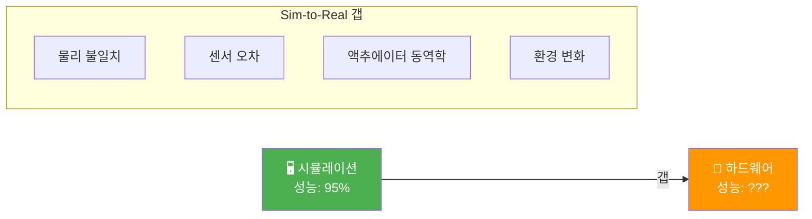
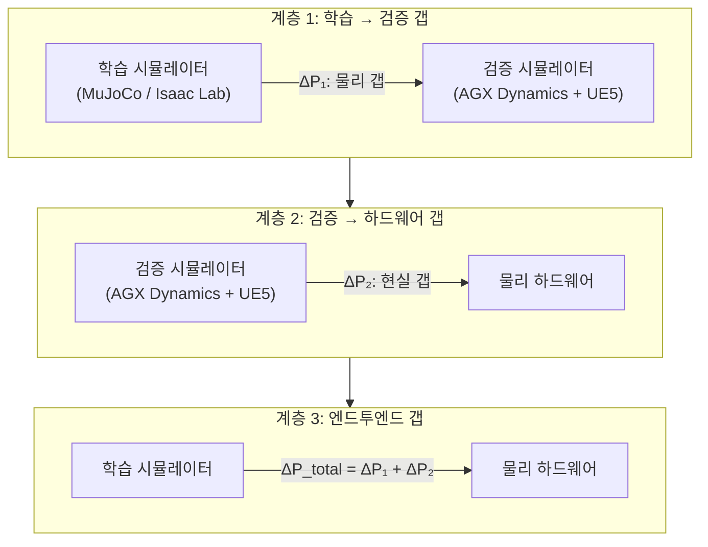
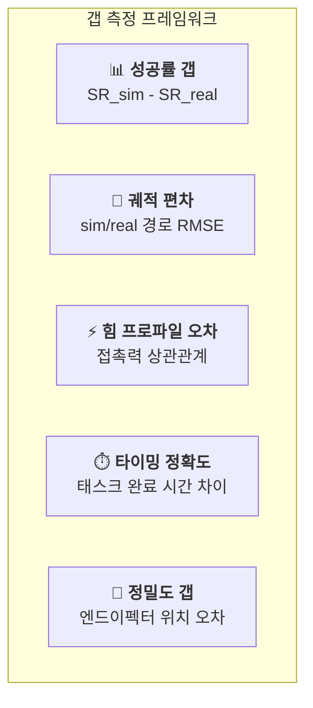
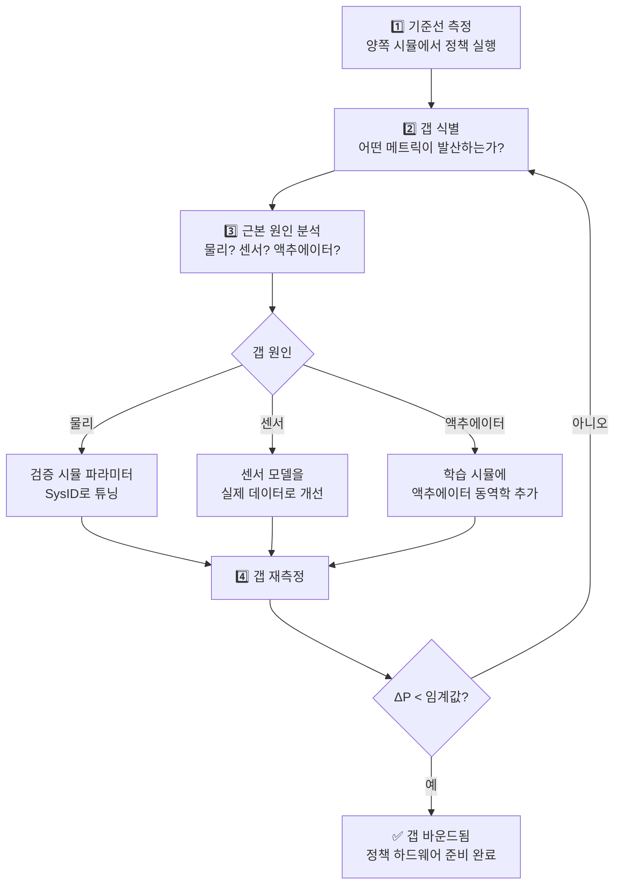

# Sim-to-Real 갭 정량화

## 핵심 과제

시뮬레이션에서 학습된 모든 로봇 정책은 결국 물리 하드웨어에서 실행되어야 합니다. 시뮬레이션과 현실 사이의 성능 차이 — **Sim-to-Real 갭** — 은 SimOps가 체계적으로 해결하고자 하는 근본적인 장벽입니다.



!!! danger "숨겨진 리스크"
    체계적인 갭 정량화 없이는, Sim-to-Real 실패를 **하드웨어에서** 발견하게 됩니다 — 가장 비싸고 시간이 많이 드는 곳에서.

## 3계층 갭 모델

SimOps는 Sim-to-Real 갭을 세 개의 독립적인 계층에서 각각 측정합니다:



### 계층 1: 학습 → 검증 갭 (ΔP₁)

SimOps의 이중 시뮬레이터 파이프라인을 통해 **측정하고 줄일 수 있는** 갭입니다.

| 메트릭 | 학습 시뮬 | 검증 시뮬 | 일반적 ΔP₁ |
|--------|---------|---------|-----------|
| 접촉력 정확도 | ±20–50% | ±2–5% | 15–45% |
| 관절 토크 추적 | ±10–30% | ±1–3% | 9–27% |
| 센서 노이즈 모델 | 가우시안만 | 하드웨어 매칭 | 가변 |
| 충돌 검출 | 단순화 메시 | 볼록 분해 | 10–30% |

### 계층 2: 검증 → 하드웨어 갭 (ΔP₂)

검증 시뮬레이터와 현실 사이의 **잔여 갭**입니다. 잘 설정된 AGX Dynamics + UE5가 이를 최소화합니다.

| 원인 | 일반적 기여도 | 완화 방법 |
|------|-------------|----------|
| 모델링되지 않은 마찰 | 2–8% | 시스템 식별 |
| 액추에이터 백래시 | 1–5% | 모터 특성화 |
| 센서 캘리브레이션 | 1–3% | 하드웨어 인더 루프 |
| 환경 요인 | 1–5% | 도메인 랜덤화 |

### 계층 3: 엔드투엔드 갭 (ΔP_total)

총 갭은 두 계층의 합성입니다:

```
ΔP_total = ΔP₁ + ΔP₂ - ΔP_overlap

SimOps 없이:   ΔP_total = ΔP₁ + ΔP₂ ≈ 30–60%  (측정 불가)
SimOps 사용:   ΔP₁은 피드백을 통해 측정 및 감소
               ΔP₂는 고충실도 검증으로 최소화
               ΔP_total ≈ 5–15%  (측정되고 바운드됨)
```

## 갭 측정 메트릭

SimOps는 각 계층에서 갭을 정량화하기 위한 표준화된 메트릭을 정의합니다:

### 태스크 수준 메트릭



| 메트릭 | 공식 | 목표 |
|--------|------|------|
| 성공률 갭 | SR_sim − SR_real | < 5% |
| 궤적 RMSE | √(Σ(p_sim − p_real)²/n) | < 10mm |
| 힘 상관관계 | corr(F_sim, F_real) | > 0.95 |
| 타이밍 차이 | \|t_sim − t_real\| / t_real | < 3% |
| 위치 오차 | \|x_sim − x_real\| | < 5mm |

### 센서 수준 메트릭

| 센서 | 갭 메트릭 | 측정 방법 |
|------|---------|----------|
| 뎁스 카메라 (D435) | 깊이 오차 분포 | 그라운드 트루스 포인트 클라우드와 비교 |
| IMU | 드리프트 비율 비교 | Allan 분산 분석 |
| 힘/토크 | 크기 + 방향 오차 | 교정된 로드셀 기준 |
| 관절 엔코더 | 위치/속도 오차 | 광학 엔코더 기준 |

## 갭 감소 파이프라인

핵심 통찰: **갭을 측정할 수 있으면 줄일 수 있습니다.**



## 실용 예시: 배드민턴 랠리 로봇

배드민턴 랠리 로봇 쇼케이스에서의 갭 정량화 초점:

| 측면 | 학습 시뮬 갭 | 검증 시뮬 갭 | 목표 |
|------|-----------|-----------|------|
| 셔틀콕 궤적 예측 | 충격 시 ±15cm | 충격 시 ±3cm | ±5cm |
| 라켓 접촉 타이밍 | ±20ms | ±3ms | ±5ms |
| 팔 관절 추적 | 최대 속도에서 ±5° | ±0.5° | ±1° |
| 셔틀콕 공기역학 | 단순화된 항력 | 풀 마그누스 + 텀블 | 실제 비행 매칭 |
| 뎁스 카메라 레이턴시 | 모델링 안 됨 | 하드웨어 매칭 | < 5ms 차이 |

!!! tip "SimOps의 장점"
    이중 시뮬레이터 접근법 없이는, 이러한 갭들을 하드웨어에서만 발견하게 됩니다. SimOps는 검증 시뮬레이터에서 미리 잡아냅니다 — 물리 프로토타이핑보다 10–100× 빠르고 저렴한 곳에서.
