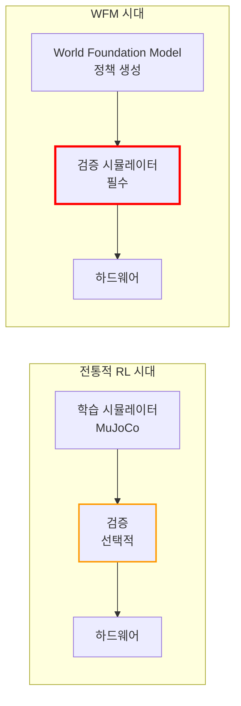
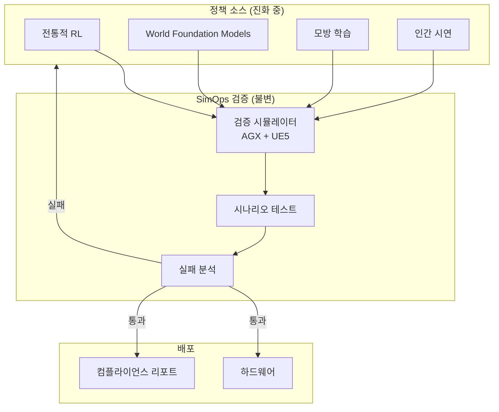

# WFM 시대의 SimOps

## World Foundation Model이란?

World Foundation Model(WFM) — World Action Model(WAM)로도 불림 — 은 물리 상호작용, 비디오, 센서 데이터의 대규모 데이터셋으로 학습된 생성형 모델입니다. 물리 세계의 동작을 예측하는 법을 학습하여, 정책 학습을 위한 전통적 물리 시뮬레이터를 대체하거나 보강할 수 있습니다.

주요 플레이어로는 NVIDIA(Cosmos), Google DeepMind(Genie), 그리고 조작 및 이동에 특화된 파운데이션 모델을 구축하는 다양한 로보틱스 스타트업이 있습니다.

## WFM의 약속

WFM은 로봇 정책 생산을 혁신할 것을 약속합니다:

- **제로샷 일반화** — 명시적 학습 없이 다양한 환경에서 작동하는 정책
- **학습된 물리** — 시뮬레이션 파라미터 수동 튜닝 불필요
- **대규모 사전 학습** — 인터넷 규모 데이터를 활용한 세계 이해
- **빠른 정책 생성** — 자연어나 시연으로부터 후보 행동 생성

## 왜 SimOps가 *더* 중요해지는가

!!! warning "흔한 오해"
    "WFM이 정책을 직접 생성할 수 있으면, 시뮬레이션이 더 이상 필요 없다."

    이것은 잘못된 생각입니다. **WFM은 학습 시뮬레이터를 대체하지, 검증 시뮬레이터를 대체하지 않습니다.** 정책 생산이 더 빨라지고 덜 투명해질수록, 물리 기반 검증의 필요성은 오히려 *증가*합니다.

### 검증 갭의 확대



정책이 WFM에서 올 때:

| 측면 | 전통적 RL | WFM 생성 |
|------|----------|---------|
| 정책 출처 | 명시적 보상 + 물리 시뮬 | 학습된 세계 모델 |
| 투명성 | 보상 함수 검사 가능 | 블랙박스 생성 |
| 실패 모드 | 시뮬 가정에서 예측 가능 | 새롭고 예상치 못한 |
| 생산 속도 | 느림 (정책당 수 시간/일) | 빠름 (정책당 수 분) |
| 검증 필요성 | 중요 | **필수** |

### SimOps 가치가 WFM과 함께 커지는 세 가지 이유

#### 1. 블랙박스 정책은 독립적 검증이 필요하다

전통적 RL 정책은 명시적 보상 함수가 있는 물리 시뮬레이터에서 학습됩니다. 정책이 무엇에 최적화되었는지 검사할 수 있습니다. WFM 생성 정책은 학습된 세계 모델의 출력물이며, 검사할 명시적 보상 함수가 없고, "물리"는 모델이 데이터에서 학습한 것이 전부입니다.

**SimOps는 WFM 출력물이 필요로 하는 독립적이고 물리 기반의 검증 레이어를 제공합니다.**

#### 2. 더 빠른 생산 = 더 많은 검증 처리량 필요

WFM이 하루 1개 대신 시간당 100개의 후보 정책을 생성할 수 있다면, 검증 병목이 크리티컬 패스가 됩니다. SimOps가 이 병목을 자동화합니다:

```
전통적:    1 정책/일    → 수동 검증 가능
WFM 시대:  100 정책/시간 → 자동화된 검증 필수
                                ↑
                          SimOps가 해결
```

#### 3. 규제 및 안전 요구사항은 사라지지 않는다

로봇이 안전 필수 애플리케이션(제조, 의료, 자율주행)으로 진입할수록, 규제 기관은 정책이 어떻게 생산되었든 **감사 가능하고 재현 가능한 검증**을 요구할 것입니다.

WFM은 이를 제공할 수 없습니다. 결정적 재생이 가능한 물리 기반 검증 시뮬레이터는 가능합니다.

## 범용 검증 레이어로서의 SimOps

SimOps는 **정책 출처에 무관하게** 작동하도록 설계되었습니다. 정책이 어디서 오든:

- 전통적 RL (MuJoCo, Isaac Lab)
- World Foundation Models (Cosmos, Genie)
- 모방 학습 (Imitation Learning)
- 인간 시연 (Human Demonstration)
- 하이브리드 접근법

...동일한 검증 파이프라인에 진입하고 동일한 물리 기반 품질 게이트를 통과해야 합니다.



## 대체가 아닌 공존

SimOps는 명확한 입장을 취합니다: **WFM과 물리 기반 검증은 공존합니다.**

| 레이어 | 현재 | WFM 시대 |
|-------|------|---------|
| 정책 생산 | 물리 시뮬에서의 RL | WFM (주력) + RL (특화) |
| 검증 | 종종 생략됨 | **SimOps** (자동화, 필수) |
| 배포 | 수동 테스트 | 감사 추적이 있는 자동화된 승격 |

정책 생산이 더 강력하고 불투명해질수록, 투명하고 물리 기반의 검증은 더 중요해집니다. **SimOps는 WFM의 경쟁자가 아닌, 필수적인 보완재로 포지셔닝됩니다.**

## 장기 비전: 인증 및 컴플라이언스

로보틱스 산업이 성숙해짐에 따라, SimOps 검증은 자연스럽게 **인증 및 컴플라이언스**로 확장됩니다:

- 특정 로봇 카테고리를 위한 **표준화된 테스트 시나리오**
- 규제 제출을 위한 **재현 가능한 검증 리포트**
- 배포된 정책에 대한 **지속적 컴플라이언스 모니터링**
- Sim-to-Real 전이 품질에 대한 **산업 벤치마크**

이는 SimOps를 단순한 개발 도구가 아닌, 로보틱스 산업의 품질 보증 생태계를 위한 인프라로 자리매김하게 합니다.
